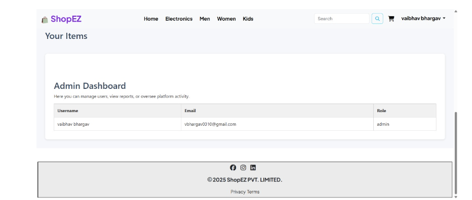

# 🛒 Full-Stack E-commerce Platform

Welcome to the GitHub repository for a robust full-stack e-commerce platform that includes user authentication, product browsing, cart management, and an admin dashboard.

## 📸 Preview

> Upload screenshots or GIFs of your homepage, login page, dashboard, and mobile view below.




---

## 📁 Project Structure

### 🌐 Client (Frontend - React)


client/ ├── node_modules/ ├── public/ │ └── images/ ├── src/ │ ├── pages/ │ │ ├── clothing/ │ │ │ ├── collect/ │ │ │ │ ├── electronic.jsx │ │ │ │ └── men.jsx │ │ │ └── show/ │ │ │ ├── showelectric.jsx │ │ │ └── showmen.jsx │ │ ├── dashboard.jsx │ │ ├── login.jsx │ │ └── signup.jsx │ ├── utils/ │ │ ├── cart.jsx │ │ └── index.jsx │ ├── footer.jsx │ └── Navbar.jsx ├── App.jsx ├── App.css ├── index.css ├── main.jsx └── index.html


---

### 🖥️ Server (Backend - Node.js + Express + MongoDB)

server/ ├── init/ │ ├── electronics.js │ ├── mens.js │ ├── women.js │ └── initialize.js ├── models/ │ ├── cart.js │ ├── child.js │ ├── electric.js │ ├── mens.js │ ├── review.js │ ├── user.js │ └── women.js ├── routes/ │ ├── clothing.js │ ├── dashboard.js │ ├── login.js │ ├── review.js │ └── search.js ├── public/ ├── .env ├── app.js ├── middleware.js └── package.json


---

## 🚀 Getting Started

### 🧩 Prerequisites

- Node.js
- MongoDB (local or cloud)
- PNPM or NPM
- Docker & Kubernetes (optional for deployment)
- Jenkins (optional for CI/CD)

### ⚙️ Installation

```bash
# Frontend
cd client
pnpm install

# Backend
cd ../server
pnpm install

# Start Frontend
cd client
pnpm run dev

# Start Backend
cd ../server
pnpm start

 API Documentation

POST /login

POST /signup

GET /clothing/men

GET /clothing/electronics

POST /cart/add

POST /review/add

etc.

📦 DevOps Pipeline (CI/CD)
✅ Jenkins Pipeline (Triggered on Push)
Runs backend & frontend tests

Builds Docker images

Pushes to Docker Hub

Deploys to Kubernetes

🐳 Docker + K8s
Docker containers for client & server

Deployed as Pods in K8s

ConfigMaps & Secrets for env vars

LoadBalanced via Services

Autoscaled with HPA

🔧 Infrastructure (via Ansible)
Provisions EC2/VMs

Installs Docker, Jenkins

Bootstraps Kubernetes

Deploys Monitoring Stack (Prometheus + Grafana)

📊 Monitoring & Observability
🔍 Prometheus + Grafana Dashboards
Pod health

CPU/RAM usage

HTTP metrics (rate, latency, error %)

Custom alerts for SLA breaches

🧪 Testing
✅ Unit testing in pipeline

✅ API tests (Postman or automation)

✅ Frontend: Jest / Cypress (recommended)

📌 Environment Variables (.env)
env
Copy
Edit
PORT=5000
MONGO_URI=mongodb+srv://...
JWT_SECRET=your_jwt_secret
SESSION_SECRET=your_session_secret
📜 License
This project is licensed under the MIT License.

🙋‍♂️ Author
Made with ❤️ by Shubham Gupta

⭐ Contributing
Pull requests are welcome! Please open an issue first to discuss what you'd like to change.

🧠 Acknowledgements
React + TailwindCSS

Node.js + Express

MongoDB + Mongoose

Docker + K8s

Jenkins + Ansible

Prometheus + Grafana
